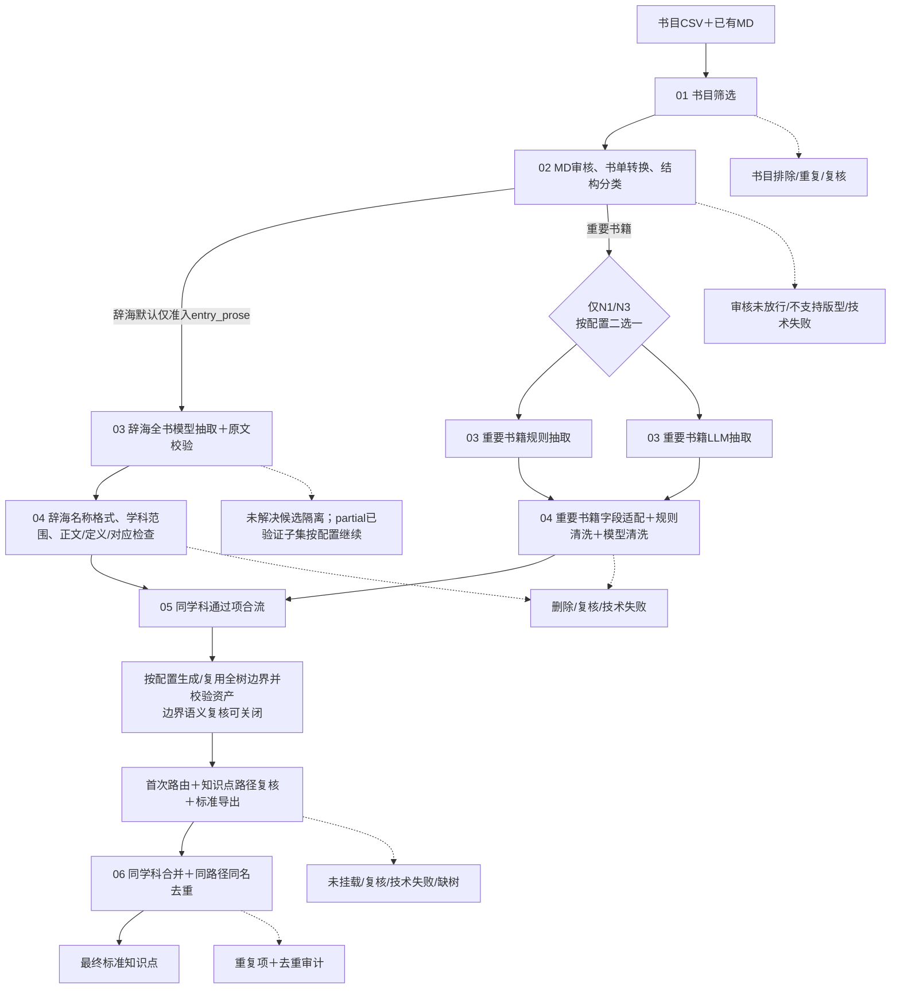

# 知识点处理管线技术说明：模块与数据流转

更新：2026-10-10。通用流程以当前代码为准；最新实测来自2026-10-10交通运输辞海0611小批，2026-10-08机械MD联调保留为历史记录。

运行方法见 [README](../README.md)。最新辞海数量、耗时及开发机产物见第2.2节；历史机械逐模块产物见 [机械MD全流程测试记录](机械MD全流程测试记录_20261008.md)。

## 1. 全流程总览



实线为主数据流；虚线为另存的审计或未通过结果，不会自动进入下一阶段。

### 1.1 各阶段交接对象

| 阶段 | 输入对象 | 核心变化 | 交给下一阶段 | 未通过的数据 |
| --- | --- | --- | --- | --- |
| 01 书目筛选 | 书目元数据，一行一本书 | 筛目标学科与元数据，分辞海/重要书籍 | 候选书目CSV | 排除、重复、待复核书目 |
| 02 审核与分类 | 候选书目＋已有MD | 审核正文、定位本地文件、判断版型 | 可抽取书单与分类结果 | REVIEW、DROP、映射歧义、技术失败 |
| 03 知识点抽取 | 放行书单＋MD、可选PDF格式 | **一本书展开为多条候选/记录**；辞海全书分块、原文定位校验 | 各分支交接结果；辞海partial须显式允许且只交接已验证子集 | 未解决候选、空释义等分支特定交接排除项 |
| 04 分轨清洗 | 抽取记录 | 辞海：名称格式→学科范围→正文/定义/对应检查；重要书籍：字段适配→规则→模型→来源恢复 | 所有必需层通过的标准知识点JSONL，尚未完成挂载 | 删除、复核、技术失败；不混入通过项 |
| 05 合流、边界与挂载 | 同学科标准知识点＋指定知识树 | 按配置生成/复用全树边界，再**新增/更新完整主路径与次相关路径** | 路径通过复核的标准知识点；独立可复用树资产 | 未挂载、复核、技术失败、缺树；空边界保留兜底状态 |
| 06 合并与去重 | 同学科已挂载文件 | 合并记录，同路径同名择优保留 | 最终交付JSONL | 重复项及去重审计 |

**范围：**已有UTF-8 MD为正文依据，PDF仅可选版式辅助。不含PDF/EPUB转MD、独立PDF质量筛选、BM25/Embedding、N2/N4/N5、低产补抽。辞海与重要书籍独立抽取、独立清洗，仅同学科通过项可在挂载阶段合流；不自动同时执行三种抽取分支。

## 2. 实测数量与验证范围

### 2.1 2026-10-08机械MD历史联调

以下是**一次历史测试结果，不是最新辞海结果、默认保留比例或质量承诺**。

| 单位/环节 | 实测变化 | 如何理解 |
| --- | --- | --- |
| 书籍 | 2 → 1本放行＋1本复核 | 不是删除1个知识点 |
| 候选 → 抽取记录 | 104 → 80 | 书内分组综合，不是第6阶段去重删除24条 |
| 抽取记录 → 清洗输入 | 80 → 71＋9条未交接 | 9条无释义，留在原始结果及排除清单 |
| 清洗 | 71 → 71 | 本批规则和模型均未删除记录 |
| 首轮路径复核 | 71 → 68合理＋1不合理＋2技术失败 | 技术失败不是内容删除 |
| 定向重试后 | 71 → 70合理＋1不合理 | 只重试2条技术失败，复用其余69条结果 |
| 去重 | 70 → 70 | 本批没有同路径同名重复项 |

[最终70条](../runs/mechanical_e2e_20261008/important/06_dedup_after_review_retry/retained.jsonl) · [数量与验证报告](../runs/mechanical_e2e_20261008/END_TO_END_REPORT.json)

历史运行目录不在Git中，以上产物链接仅在保留该目录的环境可用。

### 2.2 2026-10-10交通运输辞海端到端实测

从0611原始书单取35条未改写行：3本具有本地完整MD/PDF的目标辞海及32条固定种子对照。选书是工作流验证，不是全量或总体随机抽样。只启动一次调度，未手动调用中间生产步骤，代码、配置及输入哈希保持一致，未覆盖正式交付。

进入抽取的是《Dictionary of Shipping Terms》和《Illustrated Glossary for Transport Statistics》，最终分别保留953条和269条；《Dictionary of Transport and Logistics》留在分类待复核队列。

| 阶段 | 实测输入与结果 | 墙钟耗时 |
| --- | --- | --- |
| 书目筛选及MD审核 | 35条原始行；3本目标进入分类 | 约1分钟 |
| 结构分类及准入 | 3本→2本第一类通过＋1本待复核 | 约4.8分钟 |
| 全书抽取及原文核验 | 两本均partial；3095条已验证候选，83个未解决项另存；completed书籍为0 | 约14.3分钟 |
| 辞海原生清洗 | 3095→3037名称通过→3036学科通过→2976最终通过 | 约29.7分钟 |
| 全树边界生成及资产校验 | 1667节点：1641个未审模型描述＋26个空边界兜底；review_mode=off | 约8.5分钟 |
| 挂载、路径复核及导出 | 2976输入＝1242挂载通过＋917待复核＋812未挂载＋5技术失败 | 约56.9分钟 |
| 同分支长度优先去重 | 1242→1222，删除20条重复；ID、保留记录正文及source不改写 | 约1.4秒 |
| 合计 | 2本进入抽取，最终1222条，分别953条和269条 | 约115分钟 |

清洗另存59条待复核和41条技术未完成，两项有重叠，不能简单相加为互斥数量。83个抽取未解决项未混入清洗或最终结果；“流程完成”不把两本partial改称全部抽取成功，也不代表所有候选都通过质量验收。

运行保持冻结的1024并发配置，抽取实际峰值只有60请求。它不是8卡256并发测速，不能据此线性估计全量耗时。新8卡配置的实际吞吐尚未测试。

分类树独立资产保存完整1667节点，原身份和路径不变；26个空边界中6个是生成技术失败，20个因父边界为空而兜底。单独复用验证新增边界模型调用为0，未重新执行生产阶段；缓存不会把未审描述或空边界升级为审核通过。

固定种子按书均衡抽24条最终保留结果，逐条比较MD词头、正文及附近上下文：22条未发现明显问题，1条`Round the world service`互参标记残留，1条`Intermodal rail transport terminal`挂载可能过窄。属于Codex辅助原文对照，不是独立人工审核，也不评估漏抽率或全量准确率。未因抽检修改生产记录。

**开发机产物：**

```text
/mnt/nas_si002991c1cm/wenke/PDF/wangqiyuan/development/knowledge_point_pipeline_cold_complete_20261010_03/
  run/03_extraction/raw/HANDOFF.json
  run/03_extraction/raw/UNRESOLVED.jsonl
  run/04_cleaning/dictionary/SUMMARY.json
  run/05_mounting/SUMMARY.json
  run/06_dedup/retained.jsonl
  acceptance/ACCEPTANCE.json
  acceptance/SEMANTIC_SAMPLE.json
  acceptance/SEMANTIC_REVIEW.json
  acceptance/全流程验收与8卡配置说明.md
```

树资产位于 `/mnt/nas_si002991c1cm/wenke/PDF/wangqiyuan/development/taxonomy_assets/transportation/5d4fdd19878738c83f1d8edaa172cc1f9b9d8b82c28790f8de26ac46d193848a/`。运行数据和树资产不提交到Git；仓库文档是结果摘要，实际证据以开发机文件为准。

## 3. 样例、路径与身份约定

**样例约定：**第3～10节的book_001、c001、r001、kp001等均为教学示意，文本也不是实际测试输出；JSON/CSV只展示相关字段，不作为可直接提交的完整接口样本。模型判断示例均为假设结果。只有第2节及明确标注的实测统计来自真实运行。

### 3.1 文件位置怎么看

| 文档记法 | 含义 |
| --- | --- |
| `knowledge_point_pipeline/...` | 相对于项目根目录的路径 |
| `<运行目录>/...` | 通用输出模板；运行目录由配置指定，不是实际名为“运行目录”的目录 |
| `<run_id>`、`<slug>` | 逐书原生任务ID、学科标识，需替换为实际值 |
| Markdown文件链接 | 可直接点击，链接目标相对于本文位置 |
| 最新辞海实测路径 | 见第2.2节的开发机产物及验收记录 |
| 历史机械实测路径 | 见[历史测试记录](机械MD全流程测试记录_20261008.md) |

### 3.2 记录身份逐级关联

| 身份层级 | 样例值 | 前后关联方式 |
| --- | --- | --- |
| 来源书 | `identifier="book_001"`，MD路径及哈希 | 定位具体来源和文件版本 |
| 原生抽取任务 | `book_id="book_001", run_id="run_example"` | 标记在哪本书的哪次抽取中产生 |
| 名称候选 | `candidate_id="c001"` | 引用原文证据单元 |
| 抽取记录 | `record_id="r001", candidate_ids=["c001"]` | 一条记录可以对应一个或多个候选 |
| 标准记录 | `id="kp001"` | 清洗、挂载、去重保持此身份 |
| 追溯侧文件 | `id="kp001", original_record={...}` | 用统一ID查回原记录 |

`kp001`仅是文档中方便阅读的示意ID；真实LLM统一ID使用哈希，不是按这一短编号生成。

LLM统一ID由 `book_id/run_id/record_id` 生成；规则记录无ID时确定性生成；已有ID转字符串。重复ID报错，不静默覆盖。挂载内部 `KP_...`、复核短请求ID仅用于映射，不替换对外ID。

## 4. 第一阶段：原始书目变为候选书目

**输入样例：原始书目CSV的部分字段。**

```csv
identifier,title,parsed_path
book_001,液压传动教材,/data/book_001.md
book_002,托盘术语,/data/book_002.md
```

**输出样例：处理结果的阅读视图，判定字段来自不同子阶段，不表示原CSV全部改写成以下列名。**

| identifier | 书名 | 规则宽召回 | 书目轨道 | 后续去向 |
| --- | --- | --- | --- | --- |
| book_001 | 液压传动教材 | 命中 | 其他重要书籍 | 假设模型精筛为KEEP，送入MD审核 |
| book_002 | 托盘术语 | 命中 | 辞海类 | 送入辞海MD审核 |

变化是**筛选书籍并附加分类/判断**，此时没有生成知识点。未命中或硬规则排除的书目不进入下游。

以下输出均相对于 `<运行目录>/`。

| 输入 → 输出 | 数据变化 |
| --- | --- |
| 书目CSV → `screening/01_recall/<slug>/` | 召回全集、满足条件、硬排除CSV；仍然一行一本书 |
| 满足条件CSV → `screening/02_metadata/` | 分为辞海、重要书籍、重复项等 |
| 重要书籍候选 → `screening/03_important_metadata/书目大模型精筛结果.csv` | 增加模型判断，仅KEEP继续 |
| 两轨候选 → `screening/04_input/MD审核输入.csv` | 汇总后在 `screening/04_tracks/` 拆成两轨审核输入 |

**边界：**本阶段不生成知识点；宽召回是关键词/元数据规则，不是BM25。当前硬门槛含年份不早于2000、支持的文件类型、zh/en及解析路径要求，跨学科迁移需检查配置。

## 5. 第二阶段：候选书目变为可抽取书单

**输入样例：上一步交接的2本候选书及其MD。**

**审核结果样例，仅展示相关字段：**

```json
[
  {"identifier": "book_001", "book_track": "其他重要书籍", "final_decision": "PASS"},
  {"identifier": "book_002", "book_track": "辞海类", "final_decision": "REVIEW"}
]
```

**转换后的 `books.json` 样例：只包含PASS且本地文件成功定位的书。**

```json
[
  {
    "identifier": "book_001",
    "title": "液压传动教材",
    "md_path": "/data/book_001.md",
    "subject_slug": "mechanical_engineering"
  }
]
```

| 后续分类样例 | 输出变化 |
| --- | --- |
| book_001分类为N1，证据校验通过 | 配置rule时进入规则抽取，配置llm时进入LLM抽取 |
| book_002仍是REVIEW | 仅保留审核记录，不生成该书的抽取结果 |
| 假设另一辞海资料审核通过且结构受支持 | 经本地分类证据校验后进入approved_books清单 |

这里的“2本变1本”是**书单减少**，不是知识点删除。

| 数据对象 | 新增或改变的信息 | 去向 |
| --- | --- | --- |
| 最终审核CSV | `identifier/book_track/final_decision`、理由、技术状态 | PASS进入书单转换，其余另存 |
| `books.json` | 明确 `identifier/title/md_path/subject_slug`；可选PDF；辞海另需scope配置 | 结构分类 |
| 结构分类结果 | 辞海entry_prose等结构族，或N1章节标题型/N3条列规则型 | 对应抽取器 |
| 辞海 `approved_books.json` | 重验原响应、MD哈希、样本证据后的放行清单 | 允许尝试抽取，不等于人工质量验收 |

主要产物为 `<运行目录>/screening/07_final/最终审核结果.csv` 和 `<运行目录>/02_structure/book_manifest/books.json`。映射审计、排除、未解决记录分别另存；不猜相似书名、不自动下载。空书单或未解决映射默认停止，有效子集需显式允许；审核/分类基于样本，不等于逐页读取整书。

## 6. 第三阶段：一本书展开为多条知识点

### 6.1 三种抽取分支的交接差异

| 分支 | 如何抽取 | 第4阶段接收 | 不能直接假定 |
| --- | --- | --- | --- |
| 辞海模型 | 全MD词头和正文范围抽取、原文回取校验 | `verified/INPUT.json`，含原名、原文、范围及上下文 | `raw_content`已经是标准定义 |
| 重要书籍规则 | N1按标题，N3按条列及规则抽取 | `knowledge_points.csv`，含名称、层级/位置等 | `knowledge_point`必然是英文，或一定有定义 |
| 重要书籍LLM | 名称发现、同书证据综合、释义生成、定向复核 | `03_extraction/llm_clean_input/records.jsonl` | 每条候选都等于一个独立知识点 |

这里列的是分支产物名/相对位置，实际位置由对应任务配置确定。重要书籍rule/llm二选一。2026-10-09起，辞海默认仅准入entry_prose；clean-prepare后进入原生v22/v9/V46清洗，不再进入重要书籍的合并清洗。其他已确认结构写入not_selected，待定和技术失败仍独立保存。

### 6.2 重要书籍LLM分支：候选、记录、交接结果三层变化

**输入样例：MD中的原文。**

```markdown
## 液压泵
液压泵是将机械能转换为液体压力能的装置。

## 液压马达
液压马达是将液体压力能转换为机械能的装置。
```

**候选层：`candidates.jsonl` 的字段节选。**

```jsonl
{"candidate_id":"c001","name":"液压泵","evidence_ids":["u001"]}
{"candidate_id":"c002","name":"液压马达","evidence_ids":["u002"]}
```

**记录层：经名称审核、证据综合后，`records.jsonl` 的字段节选。**

```jsonl
{"record_id":"r001","book_id":"book_001","run_id":"run_example","name":"液压泵","definition":"液压泵是将机械能转换为液体压力能的装置。","candidate_ids":["c001"],"evidence_ids":["u001"]}
{"record_id":"r002","book_id":"book_001","run_id":"run_example","name":"液压马达","definition":"液压马达是将液体压力能转换为机械能的装置。","candidate_ids":["c002"],"evidence_ids":["u002"]}
```

| 交接样例 | 结果 |
| --- | --- |
| r001、r002完整且通过原生交接校验 | 加入统一id、tag、source，交给第4阶段 |
| 假设r003的definition为空 | 留在原始记录，写入交接排除清单，不送入统一清洗 |
| 假设多个候选描述同一个知识单元 | 可能综合为一条record，candidate_ids保留多个来源候选 |

此例恰好2候选形成2记录，不代表候选与最终记录必然一一对应。

| 内容 | 保留/变换方式 |
| --- | --- |
| 名称 | 必须有同书原文依据，不从外部补译 |
| 定义 | 允许依据同书证据总结改写，不补外部事实 |
| 候选与证据 | `candidate_ids/evidence_ids`关联原文单元；`name_decisions.jsonl`记录名称审核 |
| 运行账本 | 保存manifest、请求/重试/token及校验结果 |
| aliases、conditions、issues、confidence等 | 留在原始结果及trace，不是全部送入清洗模型 |

**分支特定门槛：**LLM交接要求非空释义，并排除未完成、未复核等异常记录；这不意味着统一清洗一律删除无定义的规则词条。被排除项不从原始数据中物理删除。

### 6.3 辞海：原文核验、partial与请求并发

辞海以完整MD分块识别词头及正文，PDF只提供辅助格式。模型选择的名称、正文必须匹配MD原文范围；抽取阶段不把raw_content当作已分离的定义或解释。`03_extraction/raw/HANDOFF.json`保存逐书状态、原生退出码及产物哈希，`UNRESOLVED.jsonl`保存未解决项；随后再次核验原文和身份，生成`verified/INPUT.json`供辞海原生清洗。

`dictionary_extraction.allow_partial`旧默认false。显式true时，只允许已结束、无技术失败或待处理HTTP504、逐书产物及覆盖声明完整的partial子集继续；未解决项不进入清洗，书籍仍标为partial。未解决项可能是引用重复、词头位置或修复身份校验不通过，不直接认定每条都抽错，更不把技术失败改判为内容DROP。

`dictionary_extraction.round_workers`必须是三个正整数，对应首轮及两轮重试。旧默认1024/256/64，8卡示例256/64/16；实际适配器和原生执行器已接通该参数。`book_workers`只控制同时处理书籍数。降低并发不保证按比例加快或减少全部技术失败；有界重试结束后未解决项仍保留。

## 7. 第四阶段：统一字段、清洗、恢复来源

本阶段按track分流。辞海由 `adapters/dictionary_cleaning.py` 调用原生清洗，保留原名、完整raw_content、原文范围及边界上下文；从FINAL_RECORDS和DISPOSITIONS核对逐层通过状态，再导出标准records和完整trace。技术失败及review不进入挂载。ID和source不改写。下文7.1起的normalize/rule/model/restore流程仅用于重要书籍。两路都输出04_cleaning/export/records.jsonl，但运行目录不同；在第5步通过mounting.inputs汇合。配置和操作见[辞海线路分离与挂载合流](辞海线路分离与挂载合流.md)。

### 7.1 数据通道：主记录与追溯记录分开走

下表所有文件均位于 `<运行目录>/04_cleaning/` 下。`trace.jsonl`是按ID关联的原始记录侧文件，**不是另一批知识点，不计入新增数量**。

| 文件（相对于本阶段目录） | 样例数据/动作 | 下游是否读取 |
| --- | --- | --- |
| `input/records.jsonl` | `id="kp001"`，标准名称、定义及辅助正文 | 规则清洗读取 |
| `input/trace.jsonl` | 同一`id="kp001"`，附完整original_record、原source、字段迁移记录 | 导出时按ID回连，不直接作为另一条知识点清洗 |
| `current/01_rule_clean/rule_pass.jsonl` | kp001通过格式规则，名称可已规范化 | 模型清洗读取 |
| `current/01_rule_clean/rule_rejected.jsonl` | 假设kp002中英文名称均为空，规则剔除 | 不进入模型清洗 |
| `current/02_model_clean/clean_standard.jsonl` | 假设kp001模型判为keep，保存修正后的标准字段 | 标准导出读取 |
| `current/02_model_clean/model_dropped.jsonl` | 假设kp003被判为不属于目标学科且无直接交叉关系 | 不进入挂载 |
| `current/02_model_clean/model_review.jsonl` | 假设kp004因依据不足待复核 | 不进入当前挂载主通道 |
| `current/02_model_clean/model_errors.jsonl` | 假设kp005请求/协议失败 | 留待重试，不当作内容删除 |
| `export/records.jsonl` | kp001的清洗后文本＋恢复后的source＋tag | 第5阶段挂载读取 |
| `export/trace.jsonl` | kp001对应的原始记录和追溯信息 | 审计回查使用 |

上表展示各文件的作用；kp001～kp005是分流示意，不代表这批真实测试发生了这些删除。

### 7.2 每一步究竟改什么

| 环节 | 输入 → 输出 | 字段变化 | 数量变化 |
| --- | --- | --- | --- |
| 适配，本地 | 抽取记录 → `input/records.jsonl` | 统一ID；明显中英错位迁移/交换；补tag；source临时简化成标签 | 正常适配不主动筛除；格式/ID冲突报错 |
| 规则，本地 | 标准输入 → `rule_pass.jsonl` | 去标题序号、无效符号、明确图表编号引用；简繁/字符规范化；过滤空名、纯编号、单字母等 | 输入＝通过＋规则删除 |
| 模型，API | 规则通过 → `clean_standard.jsonl` | 判断学科、独立知识单元、双语对应；修正标题；整理定义/描述及校验证据 | 模型输入＝keep＋drop＋review＋error |
| 导出，本地 | 模型keep → `export/records.jsonl` | 保留清洗后的文本；恢复原source对象；补tag | 导出数＝keep数；其他队列另存 |

### 7.3 字段错位修正样例

**仅为字段示意，不是本次真实输出；只列出相关字段。**

```text
抽取结果
  id: 1
  name: "Hydraulic pump"
  knowledge_point: ""
  source: {identifier: "book_001", book_title: "书名", ...}

字段适配后：input/records.jsonl
  id: "1"                         ← 统一字符串
  name: ""
  knowledge_point: "Hydraulic pump" ← 移入英文槽，不翻译
  tag: "机械工程"                 ← 来自任务配置
  source: "书名"                  ← 临时简化标签

旁路：input/trace.jsonl
  id: "1"
  original_record: {完整原记录...}
  moves: ["name->knowledge_point"]

规则＋模型清洗
  keep：保留或修正后的标准文本 → clean_standard.jsonl
  drop / review / error：另存，不进入当前挂载主通道

标准导出：export/records.jsonl
  id: "1"
  name / knowledge_point / definition: 使用清洗后的值
  tag: "机械工程"
  source: {identifier: "book_001", book_title: "书名", ...}
                                     ↑ 恢复来源，不撤销文本修正
```

**边界：**辅助raw_content/explanation/source_quote不直接冒充definition；学科判断针对指定学科，允许直接交叉，不在所有学科中选唯一赢家；证据重合检查和来源回填不等于逐字原文验收。OpenCC缺失时报告标记简繁转换不可用。

## 8. 第五阶段：知识点增加分类路径

本阶段可通过`mounting.inputs`合流同一学科多路已清洗结果，仍核验每路通过判定、ID、source和证据哈希。准备知识树后，按配置生成或复用完整边界资产，再执行首次路由、知识点路径复核和标准导出；不因关闭边界语义复核而取消知识点路径复核。

### 8.1 按配置补充并复用分类树边界

开启`mounting.boundaries.enabled`后，顺序为prepare→generate→verify→route→review→export；缓存命中时generate改为加载已核验资产，不调用边界模型。新示例开启生成，旧配置未设置enabled时保持仅使用已有树信息的行为。

| 配置/资产 | 当前契约 |
| --- | --- |
| review_mode=strict | 默认旧行为，执行同级及逐祖先语义复核；通过也不等于专家审核 |
| review_mode=off | 新示例口径：只生成并核验原文生成证据、卡片结构、节点身份和完整覆盖，非空卡片仍为`model_generated_unreviewed` |
| failure_policy=strict / empty | 独立于review_mode；strict遇未通过结果停止，empty允许有限处理后未解决组及受影响后代以空描述继续 |
| cache_dir | 独立树资产库，按学科、原树、输入、服务/模型、生成参数、模式及代码版本严格匹配；不能与reuse_from同时设置 |
| 匹配命中/版本变化/损坏 | 命中零新增边界模型调用；参数或树变化为新版本；匹配资产损坏则停止，不静默放行 |
| 保存内容 | 原树`taxonomy_original.json`、增强树`taxonomy_enriched.json`、边界卡片及生成证据、`MANIFEST.json`；不含知识点数据或API密钥 |

资产目录为`cache_dir/{subject_slug}/{asset_key}/`，原子发布且已保存版本不覆盖；源分类树的节点身份、路径和父子关系不改。下一批继续设置同一原树和cache_dir，不需要把旧筛选或知识点中间结果带入新批次。

`BOUNDARIES_VERIFIED.json`核对运行资产，不一律意味着语义复核通过。strict且不允许空兜底时安装`cross_validated_cards.jsonl`；off或允许空兜底时安装`runtime_cards.jsonl`。`verified_nodes`、`unreviewed_nodes`、`fallback_nodes`分开统计；空边界保持`empty_boundary_fallback`，仅按原树名称/路径提供参考。缓存复用不会改变这些审核状态，知识点路径仍独立复核。生成并发、超时或输出预算等参数变化也会导致新缓存键。

### 8.2 知识点路由与路径复核

**输入样例：清洗后的记录，以下仅列相关字段。**

```json
{
  "id": "kp001",
  "name": "液压泵",
  "definition": "液压泵是将机械能转换为液体压力能的装置。",
  "tag": "机械工程",
  "main_tags": "",
  "related_tags": [],
  "source": "液压传动教材"
}
```

**输出样例：假设路径及证据复核通过。**

```json
{
  "id": "kp001",
  "name": "液压泵",
  "definition": "液压泵是将机械能转换为液体压力能的装置。",
  "tag": "机械工程",
  "main_tags": "机械工程/机械设计与基础零部件/机械传动与流体传动/液压与气压动力传动/液压动力元件与传动回路",
  "related_tags": [],
  "source": "液压传动教材"
}
```

| 样例判断 | 保存位置 | 与输入相比 |
| --- | --- | --- |
| 主路径合理且编码、层级、分数通过 | `mounted_standard.jsonl` | 更新分类字段，正文和ID不变 |
| 分数或路径证据不足 | `review.jsonl` | 不自动交付 |
| 主路径不合理 | `not_mounted.jsonl` | 不等于该知识点本身无效 |
| API/协议/校验失败 | `technical_failure.jsonl` | 可修复后重试 |
| tag无对应知识树 | `unconfigured.jsonl` | 不套用相邻学科树 |

| 前后对照 | 处理约束 |
| --- | --- |
| 输入旧main_tags → 本轮候选路径 | 发给路由器时清空旧主路径，不把旧挂载当新结论 |
| tag → 目标知识树 | 不做全学科竞争分类；缺树单列，不自动改用邻近学科树 |
| 原树 → 生成/复用边界 → 本地语义卡片 | 按8.1配置补全或复用全树边界；未开启时只用已有信息；层级按结构深度，不按路径斜杠数量 |
| 通过校验的主路径 → main_tags | 默认最终分数≥0.85，允许L2–L5，根为L0；优先具体节点，也可停父节点 |
| 合理次路径 → related_tags | 默认最多2条候选次路径独立复核；主路径失败不自动用次路径替代 |
| 输入正文、ID、source → 标准导出 | 保持不变；只更新分类字段，缺少tag时补标签 |

L1–L3默认候选路由阈值0.6，不等于最终接纳阈值。不合理路径触发独立反证复核；证据须是连续原文，不允许省略号拼接。分数不是实测准确率，不强制挂载比例。2026-10-08历史机械样本未生成次路径，最终L2/L3/L4/L5为4/1/64/1条；不把此分布套用到最新辞海批次。

## 9. 第六阶段：多份已挂载数据合并去重

**输入样例：以下两条来自不同文件，学科和完整主路径相同，ID不同。**

为避免重复展示长路径，本表省略两条相同的main_tags；它们均为第5阶段样例中的完整路径，实际数据不会省略。

| id | name | knowledge_point | definition | source |
| --- | --- | --- | --- | --- |
| kp001 | 液压泵 | 空 | 液压泵是将机械能转换为液体压力能的装置。 | 液压传动教材 |
| kp006 | 液压泵 | 空 | 液压泵将机械能转换为液体压力能。 | 液压术语手册 |

**输出样例：按默认length模式。**

| 产物 | 内容 | 原因/变化 |
| --- | --- | --- |
| `retained.jsonl` | 原样保留kp001 | 中文定义更长；不重写定义，不合并两条来源 |
| `removed.jsonl` | 保存kp006 | 同学科、同主路径、同名，作为重复项移出交付 |
| `duplicate_audit.jsonl` | 记录kp006与最终保留项kp001的关联 | 可以回查为何去除以及保留了哪一条 |

若两条主路径不同，即使同名也不按此规则合并；若两条ID相同则报冲突，不进入上述择优逻辑。

| 项目 | 当前行为 |
| --- | --- |
| 同名规范化 | 仅大小写、首尾空白；不是同义词语义去重 |
| 保留优先级 | 中文定义长度 → 英文定义长度 → 原输入顺序 |
| 删除约束 | 必须与最终保留项直接同名，不借已删除记录无限扩散 |
| ID、正文、来源 | 不重编号、不重写、不合成多个来源；重复ID报错 |
| 多文件合并 | 可重复传 `--input`；默认length，不调用可选LLM比较 |
| 验收 | SUMMARY、VERIFICATION报告；输入＝保留＋重复删除 |

## 10. 最终字段与原文回溯

| 字段 | 形成环节 | 含义 |
| --- | --- | --- |
| id | 03交接/04适配 | 稳定记录身份，不等于概念唯一ID |
| name、knowledge_point | 03抽取＋04清洗 | 中文名、英文名；语言错位修正不等于自动翻译 |
| definition、en_definition | 抽取及清洗 | 有来源依据的定义；规则抽取可能为空 |
| description、en_description | 抽取及清洗 | 补充描述，可为空 |
| tag | 任务/书籍学科配置 | 指定学科，不是具体节点 |
| main_tags、related_tags | 05挂载复核 | 完整主路径及合理次路径 |
| source | 来源记录，04导出恢复 | 原有字符串或对象，不强制压成书名 |

**回溯样例：要核对最终记录kp001的原文依据时。**

| 查找文件/对象 | 示例关联值 | 得到什么 |
| --- | --- | --- |
| 最终标准记录 | `id="kp001"` | 清洗后的名称、定义和挂载路径 |
| 同批清洗trace、挂载audit | `id="kp001"` | 原始记录及路径判断证据 |
| 原生LLM记录 | `book_id="book_001", run_id="run_example", record_id="r001"` | 所属书、抽取运行和原生记录 |
| 候选与证据引用 | `candidate_ids=["c001"], evidence_ids=["u001"]` | 原文证据单元标识 |
| 对应units.json、source.md及原MD哈希 | `u001` | 定义来自哪个原文片段，是否是同一版本文件 |

上表为LLM分支回溯示例；规则/辞海按保留的源行或字符范围回查。汇总报告不能替代逐条证据文件。

## 11. 模块入口速查

下列链接指向本管线内的逻辑代码。

| 阶段 | 主要入口 |
| --- | --- |
| 总调度/离线检查 | [pipeline.py](../pipeline.py)、[validate_offline.py](../validate_offline.py) |
| 01 书目及两轨审核包装 | [run_stages.sh](../modules/book_screening/examples/run_stages.sh) |
| 02 书单转换/辞海放行 | [screened_books_to_manifest.py](../adapters/screened_books_to_manifest.py)、[approve_dictionary_books.py](../adapters/approve_dictionary_books.py) |
| 02 结构分类 | [classify_books.py](../modules/dictionary/classification/scripts/classify_books.py)、[layout_model_validation.py](../modules/important_books/scripts/layout_model_validation.py) |
| 03 辞海原生抽取/交接 | [run_fullbook_v5.py](../modules/dictionary/src/run_fullbook_v5.py)、[dictionary_extraction.py](../adapters/dictionary_extraction.py) |
| 03 重要书籍规则 | [important_route.py](../adapters/important_route.py) |
| 03 重要书籍LLM/交接 | [cli.py](../modules/important_llm/src/book_extractor/cli.py)、[important_llm_io.py](../adapters/important_llm_io.py) |
| 04 辞海原生清洗/通过项证明 | [dictionary_cleaning.py](../adapters/dictionary_cleaning.py)、[cleaning_handoff.py](../adapters/cleaning_handoff.py) |
| 04 重要书籍字段适配/清洗 | [normalize_records.py](../adapters/normalize_records.py)、[rule_clean.py](../modules/cleaning/scripts/rule_clean.py)、[model_clean.py](../modules/cleaning/scripts/model_clean.py) |
| 05 知识树适配/衔接 | [mounting_assets.py](../adapters/mounting_assets.py)、[mounting_bridge.py](../adapters/mounting_bridge.py) |
| 05 边界生成/校验/缓存 | [generate_semantic_boundaries.py](../modules/mounting/pipeline/generate_semantic_boundaries.py)、[mounting_boundaries.py](../adapters/mounting_boundaries.py)、[mounting_tree_cache.py](../adapters/mounting_tree_cache.py) |
| 05 路由/复核 | [hierarchical-knowledge-labeling-beam-v3.py](../modules/mounting/mapping_runtime/scripts/hierarchical-knowledge-labeling-beam-v3.py)、[mount_pilot_v3.py](../modules/mounting/review_lib/mount_pilot_v3.py) |
| 06 去重 | [dedup.py](../modules/dedup/dedup.py) |

原包在 `knowledge_point_pipeline/origin_zip/`，来源、哈希及集成修改见 [MODULE_MANIFEST.json](../MODULE_MANIFEST.json)。LLM核心为交付包副本，未修改上游源目录。

## 12. 统计、恢复及验证边界

### 12.1 计数规则

| 环节 | 核对关系 | 常见误读 |
| --- | --- | --- |
| 书目 | 按保留、排除、复核、技术问题核对输入 | 书数与知识点数相加 |
| 抽取 | 候选覆盖、成员归属、记录及错误联合核验 | 候选数等同最终知识点数 |
| 清洗 | 重要书籍按规则/模型分流核对；辞海按名称、学科、正文逐层核对原生判定及通过项证明 | 忽略删除，或把review/技术失败并入keep；跨层队列可能重叠，不能直接相加 |
| 挂载 | 选中输入＝mounted＋review＋not_mounted＋technical_failure＋unconfigured | 重试次数当新增记录 |
| 去重 | 输入＝retained＋removed | 原生review是retained子集，不能重复累加 |

### 12.2 恢复与环境

| 操作 | 当前行为 |
| --- | --- |
| plan / check / run | 生成计划 / 检查文件与配置依赖、不探测服务 / 执行阶段 |
| `--resume` | 跳过命令与产物检查通过的已完成任务 |
| `--retry-failed` | 显式重试失败任务，保留历史，不清空输出 |
| 原生LLM `--resume-existing` | 同配置、同MD恢复；结果为全量快照，不可盲目追加 |
| 挂载 `--retry-failed-reviews` | 仅重试技术失败，复用其他复核；随后重新导出、去重 |
| 环境 | 通用模块Python 3.10+；重要书籍LLM独立Python 3.12及锁定依赖 |
| 资源 | 执行端主要CPU/内存/tokenizer，GPU由模型服务承担；各阶段并发含义不同 |
| 8卡配置 | [pipeline.8card.example.json](../configs/pipeline.8card.example.json)：常规API上限256，抽取256/64/16；实际吞吐未测，不能热改已冻结任务 |
| 分类树复用 | cache_dir匹配时复用已验证树资产，仍执行本轮资产和路径复核；不复用旧书目判断或知识点结果 |
| 跨版本或改树 | 使用新目录；尚无覆盖全部模块的统一内容/代码指纹恢复机制 |

### 12.3 已验证与尚未验证

2026-10-08机械重要书籍N1的LLM路线实跑至70条；2026-10-10交通运输辞海小批从0611筛选自动走到挂载去重，保留1222条。开发机本轮七套离线回归513项通过、3项缺历史样本跳过，包含8卡配置的实际离线子进程传参链路；历史98项验证不与其累加。

最新验收为`full_flow_operational_passed=true`、`semantic_quality_approved=false`。小批2本partial及83个未解决项隔离，24条原文对照仍发现格式和挂载风险。尚无N3真实端到端、全量书籍质量、跨学科语义准确率、独立人工准确率、漏抽率或8卡规模吞吐结论。技术衔接、条数守恒和树资产校验不能替代这些验收。
